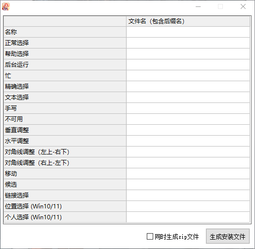

# PointerCraft

PointerCraft 是一个轻量级且高效的工具，专为 Windows 用户设计，用于轻松创建、打包和安装自定义鼠标光标方案。告别手动编辑复杂的 `.inf` 文件，只需通过直观的拖放操作，即可将你的创意变为现实。

## ✨ 主要特性

- 🎨 **直观的拖放界面**: 只需将你的 `.cur` 或 `.ani` 文件拖入表格对应行，即可自动填充文件名，无需手动输入。
- ⚙️ **自动化 .inf 文件生成**: 程序会根据你填写的信息和文件列表，在后台自动生成符合 Windows 规范的安装脚本 (`.inf` 文件)。
- 📦 **一键式打包**: 轻松将所有光标文件和安装脚本整合在一起，方便分享和备份。
- 🚀 **轻量快速**: 无需安装，即开即用，不占用系统资源。

## 🚀 如何使用

1.  **运行程序**: 双击打开 `PointerCraft.exe`。
2.  **拖入文件**: 将你的光标文件（`.cur` 静态光标, `.ani` 动画光标）从文件夹拖放到程序窗口表格中对应的行。程序会自动获取文件名并填入。
3.  **填写信息**: 在指定位置输入你的光标方案名称（例如 "我的酷炫指针"）。
4.  **生成方案**: 点击“生成安装文件”按钮，程序会生成一个包含所有光标文件和一个 `.inf` 安装脚本的文件夹。
5.  **安装**: 右键点击该 `.inf` 文件，选择“安装”，即可在 Windows 设置中应用你的新光标方案。

## 📁 支持的文件类型

- `.cur` - 静态光标文件
- `.ani` - 动画光标文件

## 💻 系统要求

- Windows 7 / 8 / 10 / 11

## 📥 下载

你可以在 [GitHub Releases](https://github.com/YUZU-384/PointerCraft/releases) 页面下载最新的版本。

## 🛠️ 技术栈

本程序使用 [易语言](https://www.dywt.com.cn/) 开发。

## 📄 许可证

本项目采用 [MIT 许可证](LICENSE)。

---

**享受打造属于你的个性化桌面体验吧！**
